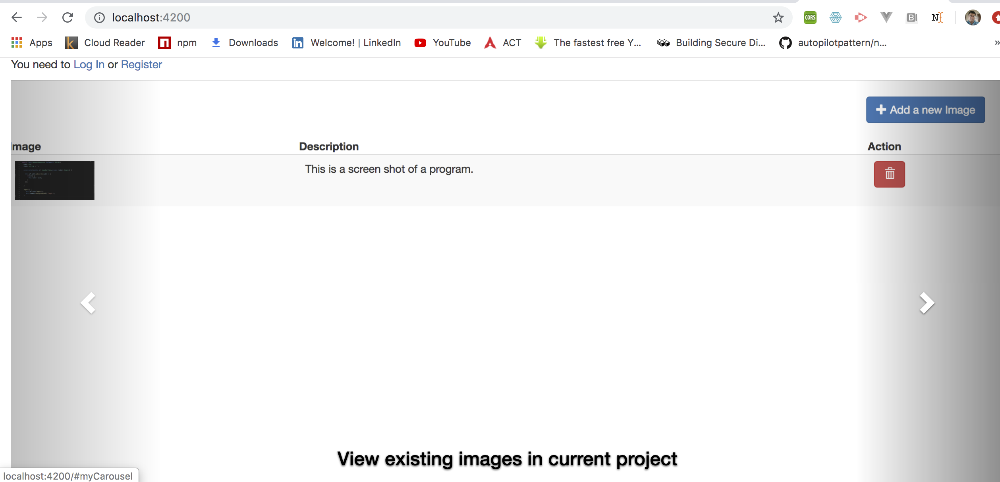

# inputMLPipeline
An app to create projects and add images with description for each of the image.This is the input stage of the ML pipeline. 

# list all projects

# add a new project

# add a new image in project 

# view current images in project

